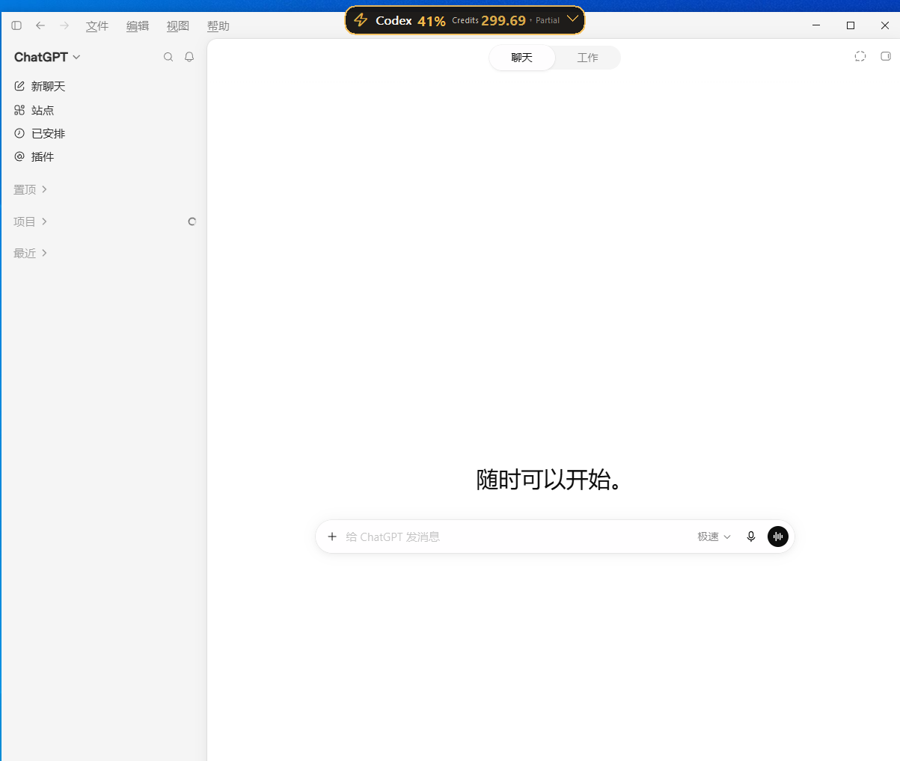
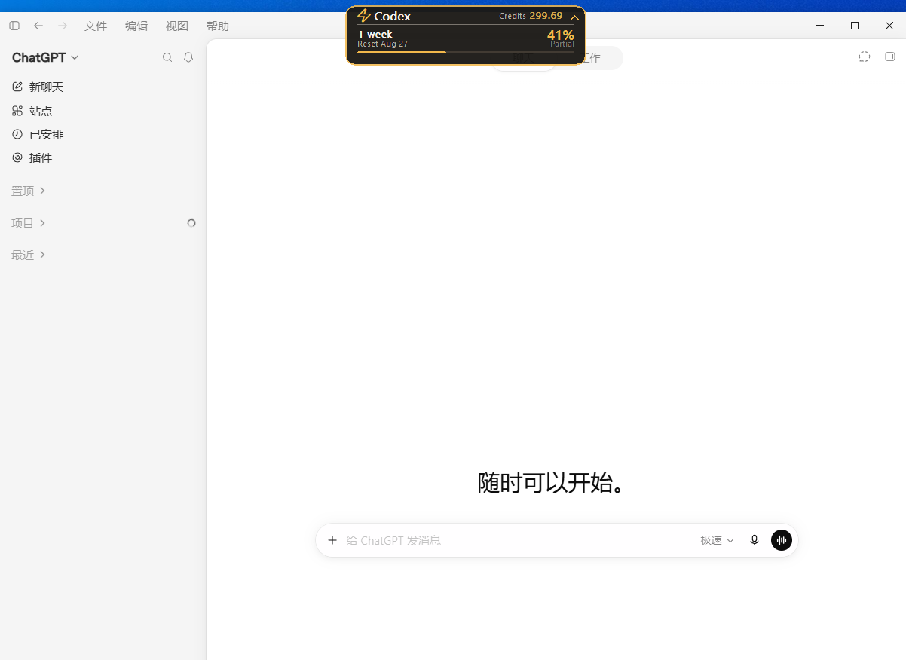

  

<h1 align="center">QuotaStrip</h1>

Windows utility for keeping Codex usage visible at a glance.

QuotaStrip keeps a compact usage notch attached to the Codex Desktop window on Windows, so account allowance information stays close to where you work.

  

## Key Features

- Attaches a compact usage overlay to the active Codex Desktop window.
- Follows window movement, resizing, maximize/restore, and monitor changes.
- Hides when the Codex window is minimized, closed, or unavailable.
- Expands to show the allowance windows returned for the current account, including remaining percentage, reset time, and data state.
- Provides a Windows tray menu with **Show Overlay** and **Quit** actions.

## Screenshots

  

## Installation

QuotaStrip `v0.1.0` will be distributed through GitHub Releases. A public release has not been published yet, so there is no download available at this time.

The release artifact is a Windows NSIS installer named `QuotaStrip_0.1.0_x64-setup.exe`. Each release artifact is accompanied by `SHA256SUMS.txt` for checksum verification.

## How It Works

1. QuotaStrip finds the current Codex Desktop window.
2. A native Windows overlay is positioned at that window's top center and tracks its geometry.
3. Usage data is read through Codex-owned local capabilities and presented without collecting prompts, conversations, or project code.

## Windows Requirements

- Windows 10 or Windows 11
- Codex Desktop

QuotaStrip is Windows-first. macOS and Linux are outside the `v0.1.0` scope.

## Privacy

QuotaStrip is local-first and does not collect prompts, conversations, or project code. It does not request OpenAI passwords, manage Codex credentials, use OCR or screen scraping, or send hidden telemetry.

Allowance windows are displayed only when returned for the current account. QuotaStrip does not assume fixed quota windows or fabricate missing usage data.

## Verification and Current Limitations

The Windows CI workflow verifies version consistency, builds the Windows application and NSIS installer, and verifies the installer artifact and SHA256 checksum.

`v0.1.0` is still in release preparation: no Git tag, GitHub Release, public installer download, or binary signature has been published.

## Contributing

Focused contributions are welcome. Please read [CONTRIBUTING.md](CONTRIBUTING.md) before opening an issue or pull request.

## Security

For vulnerability reporting and disclosure guidance, see [SECURITY.md](SECURITY.md).

## License

QuotaStrip is licensed under the [MIT License](LICENSE).

## Disclaimer

**Independent open-source utility for Codex on Windows. Not affiliated with or endorsed by OpenAI.**

“Codex” and “OpenAI” are used only to identify the product this utility is designed to work with. This repository does not claim official API support, certification, sponsorship, or endorsement.
